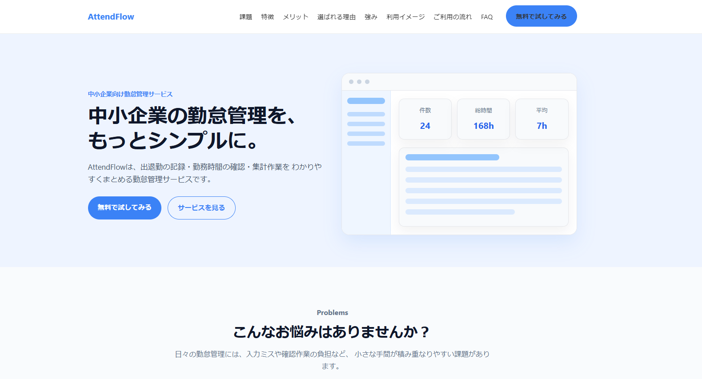

# AttendFlow（アテンドフロー）

中小企業向けの勤怠管理サービスを想定したランディングページ（LP）です。  
課題提示から解決策、導入メリットまでを一貫して伝える構成で制作しました。

---

## 🔗 デモURL

https://ryuunosuke-1113.github.io/attendance-lp/

---

## 📸 スクリーンショット

---

## 🧠 制作背景

現職の事務業務において、勤怠管理はExcelで運用されることが多く、

- 入力ミスが発生しやすい  
- 集計に時間がかかる  
- データの確認が煩雑  

といった課題があると感じていました。

そこで、勤怠管理ツールの導入による業務効率化を想定し、  
その価値を伝えるLPを制作しました。

---

## 🎯 目的

- 業務改善ツールを紹介するLPの制作  
- HTML / CSS / JavaScriptによるコーディング力のアピール  
- サービス理解からUI設計まで一貫して行えることの証明  

---

## ✨ 工夫したポイント

### ■ 課題 → 解決のストーリー設計

ユーザーの悩みを提示し、解決策としてサービスを提示する構成にすることで、  
自然にサービスの価値が伝わるよう設計しました。

---

### ■ 業務理解を反映したコンテンツ設計

実際の業務フローをもとに、以下の機能を紹介しています。

- 勤怠入力  
- 実働時間の自動計算  
- 検索・月別フィルター  
- CSV出力  
- 入力バリデーション  

単なるデザインではなく、業務改善の視点を意識しました。

---

### ■ 視認性・可読性を意識したUI設計

- カードUIで情報を整理  
- セクションごとに余白を確保  
- 強調色を統一し、視線誘導を設計  

---

### ■ インタラクションの実装

ユーザー体験を向上させるため、以下の動きを実装しました。

- ハンバーガーメニュー  
- FAQの開閉  
- スムーススクロール  
- スクロール時のフェードイン  

---

### ■ 利用イメージを伝えるUI設計

ヒーローセクションにダッシュボード風UIを配置し、  
サービス利用後のイメージが直感的に伝わるようにしました。

---

## 🔧 技術的な工夫

- JavaScriptでスクロールイベントを制御し、フェードインの発火タイミングを調整  
- ナビゲーションの状態管理を行い、メニュー開閉の挙動を制御  
- DOM操作を整理し、可読性と保守性を意識した構造にした  
- レスポンシブ対応を考慮したレイアウト設計  

---

## 🛠 使用技術

- HTML  
- CSS  
- JavaScript  

---

## 📂 ファイル構成

attendance-lp/
├─ index.html
├─ style.css
├─ script.js
└─ images/

---

## 🚀 今後の改善予定

- 実際の管理画面（勤怠管理ツール）との連携  
- フレームワーク（Reactなど）を用いた再設計  
- パフォーマンス改善（アニメーションの最適化）  

---

## 🙌 補足

このLPは、別途制作した勤怠管理ツールをもとに構築しています。  

ツールとLPをセットで制作することで、  
「サービス設計からUIまで一貫して考えられること」を意識しました。