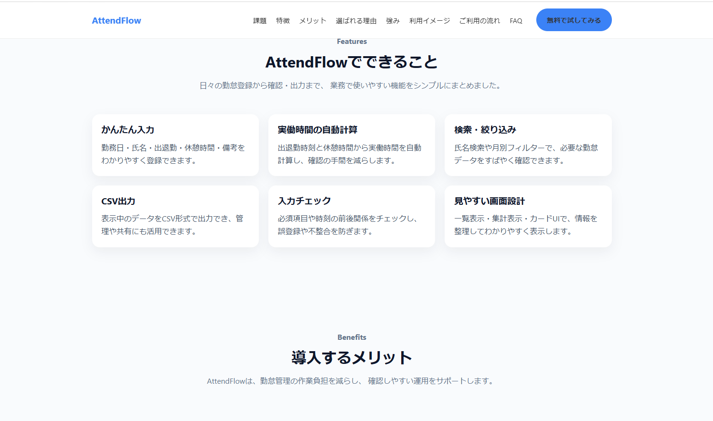

# AttendFlow（アテンドフロー）

中小企業向けの勤怠管理サービスを想定した、ランディングページ（LP）です。  
業務での利用をイメージし、課題提示から解決、導入メリットまでを一貫して伝える構成で制作しました。

---

## 🔗 デモURL

https://（ここにGitHub PagesのURLを貼る）

---

## 📸 スクリーンショット

---

## 🧠 制作背景

勤怠管理は、Excelでの運用による入力ミスや集計の手間など、日々の業務負担が大きくなりやすい領域だと感じています。

そこで、

- 入力
- 確認
- 集計
- 出力

といった一連の流れをシンプルにまとめたサービスを想定し、  
その魅力を伝えるLPを制作しました。

---

## 🎯 目的

- 業務改善ツールを紹介するLPの制作
- HTML / CSS / JavaScriptのコーディング力のアピール
- クラウドワークスなどでの案件獲得につなげる

---

## ✨ 工夫したポイント

### ① 課題 → 解決のストーリー構成

ユーザーの悩みを提示し、その解決策としてサービスを紹介する流れにしています。

---

### ② 業務を意識したコンテンツ設計

以下のような実務を意識した内容を盛り込みました。

- 勤怠入力
- 実働時間の自動計算
- 検索・月別フィルター
- CSV出力
- 入力バリデーション

---

### ③ 視認性を意識したUI設計

- カードUIで情報を整理
- セクションごとに余白を確保
- 強調色を統一（青系）

---

### ④ LPらしい動きの実装

- ハンバーガーメニュー
- FAQの開閉
- スムーススクロール
- スクロール時のフェードイン

---

### ⑤ 管理画面を意識したモックアップ

ヒーロー部分にダッシュボード風UIを配置し、  
実際の利用イメージが伝わるようにしました。

---

## 🛠 使用技術

- HTML
- CSS
- JavaScript

---

## 📂 ファイル構成

attendance-lp/
├─ index.html
├─ style.css
├─ script.js
└─ images/

---

## 🚀 今後の改善予定

- 実際の管理画面との連携（デモ画面へのリンク追加）
- UIのさらなるブラッシュアップ
- アニメーションの最適化

---

## 🙌 補足

このLPは、既に制作した勤怠管理ツールのイメージをもとに構築しています。  
サービス紹介と実際の機能イメージをセットで伝えることで、より実務的なポートフォリオになるよう意識しました。
